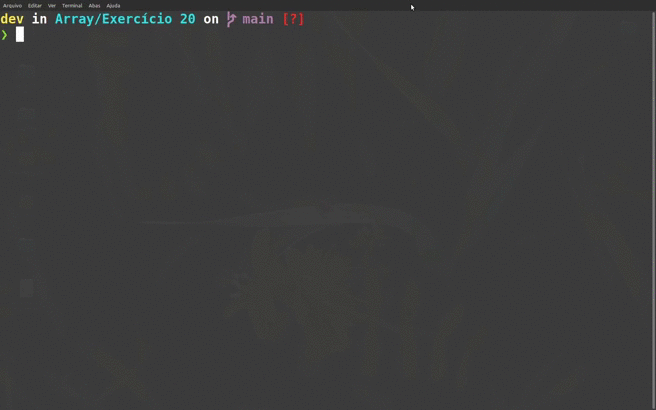

## ☕️ Exercícios Array (Java)

<div align="center" >
    
</div>

## 📑 Sobre

Exercícios de fixação sobre Array, desenvolvido para matéira de Programação e Algoritmos, da Etec de Itaquaquecetuba.

<details>
<summary>Lista de exercícios</summary>

1) Desenvolva um sistema que receba em um vetor A, 5 elementos do tipo texto. Construir um vetor B de
mesmo tipo e tamanho e com os "mesmos" elementos do vetor A.

2) Desenvolva um sistema que receba em um vetor A, 8 elementos inteiros. Construir um vetor B de mesmo
tipo e tamanho e com os elementos do vetor A multiplicados por 2.

3) Desenvolva um sistema que receba em um vetor A com 15 elementos inteiros. Construir um vetor B de
mesmo tipo e tamanho, sendo que cada elemento do vetor B deverá ser o quadrado do respectivo
elemento de A.

4) Desenvolva um sistema que receba em um vetor A com 10 elementos inteiros. Construir um vetor B de
mesmo tipo e tamanho, sendo que cada elemento do vetor B deverá ser o respectivo elemento de A
multiplicado por sua posição (ou índice).

5) Desenvolva um sistema que receba dois vetores A e B cada um com 10 elementos inteiros. Construir um
vetor C, onde cada elemento de C é a multiplicação dos respectivos elementos em A e B.

6) Desenvolva um sistema que receba em um vetor A, 10 elementos inteiros. Construir um vetor B de mesmo
tipo e tamanho, sendo que cada elemento do vetor B deverá ser o resto da divisão do respectivo elemento
de A por 2 (dois).

7) Desenvolva um sistema que receba em um vetor A, 10 elementos inteiros. Defina e exiba a quantidade
de elementos armazenados neste vetor que são pares.

8) Desenvolva um sistema que receba em um vetor A, 10 elementos inteiros. Defina e exiba a soma de todos os elementos armazenados neste vetor.

9) Desenvolva um sistema que receba em um vetor A, 10 elementos inteiros. Determine a soma dos elementos armazenados neste vetor que são múltiplos de 5.

10) Desenvolva um sistema que receba em um vetor A, 10 elementos inteiros. Defina e escreva a média
aritmética simples dos elementos ímpares armazenados neste vetor.

11) Desenvolva um sistema que receba em um vetor A, 10 elementos inteiros. Calcule e exiba:

- a soma de elementos armazenados neste vetor que são inferiores a 15;
- a quantidade de elementos armazenados no vetor que são iguais a 15;
- a média dos elementos armazenados no vetor que são superiores a 15.


12) Desenvolva um sistema onde o usuário digite os valores de um vetor A com 10 elementos inteiros correspondentes as idades de um grupo de pessoas. Determine e exiba a quantidade de pessoas que possuem idade superior a 35 anos.

13) Desenvolva um sistema onde o usuário digite os valores de duas notas bimestrais para um conjunto de
10 alunos. Armazenar as notas informadas em dois vetores “Nota1” e “Nota2” do tipo real. Escreva um
programa que calcule a média aritmética simples das notas informadas armazenando o resultado em um
vetor “Result” de mesmo tipo e tamanho. Ao mostrar os resultados exibir a situação de cada aluno. Se a média calculada for superior ou igual a 7 o aluno estará “aprovado”, caso contrário, a situação do aluno será “reprovado”.

14) Desenvolva um sistema onde o usuário digite os valores de um vetor A com 10 elementos inteiros.
Construir um vetor B de mesmo tipo e tamanho, obedecendo as seguintes regras de formação:
- Vetor B deverá receber 1 quando Vetor A for par;
- Vetor B deverá receber 0 quando A for ímpar.


15) Desenvolva um sistema onde o usuário digite os valores de dois vetores A e B cada um com 10 elementos
inteiros. Construir um vetor C de mesmo tipo e tamanho, obedecendo as seguintes regras de formação:

- Vetor C deverá receber 1 quando Vetor A for maior que Vetor B;
- Vetor C deverá receber 0 quando Vetor A for igual a Vetor B;
- Vetor C deverá receber -1 quando Vetor A for menor que Vetor B.


16) Desenvolva um sistema onde o usuário digite os valores de um vetor A com 10 elementos inteiros.
Construir um vetor B de mesmo tamanho, obedecendo as seguintes regras de formação:

- Vetor B deverá receber 'a' quando Vetor A for menor que 7;

- Vetor B deverá receber 'b' quando Vetor A for igual a 7;

- Vetor B deverá receber 'c' quando Vetor A for maior que 7 e menor que 10;

- Vetor B deverá receber 'd' quando Vetor A for igual a 10;

- Vetor B deverá receber 'e' quando Vetor A for maior que 10.

17) Desenvolva um sistema onde o usuário digite os valores de um vetor A com 10 elementos e construir um
vetor B de mesmo tipo e tamanho e com os mesmos elementos de A, sendo que estes deverão estar
invertidos, ou seja, o primeiro elemento de Vetor A passa a ser o último de Vetor B, o segundo elemento
de Vetor A passa a ser o penúltimo de Vetor B e assim por diante.

18) Desenvolva um sistema onde o usuário digite os valores de dois vetores A e B com 10 elementos cada.
Construir um vetor C, sendo este a junção dos dois outros vetores. Os primeiros 10 elementos de C
deverão receber os elementos de A e os últimos elementos C deverão receber os elementos de B. Desta
forma, C deverá ter o dobro de elementos de A e B, ou seja, 20 elementos.

19) Desenvolva um sistema onde o usuário digite os valores de um vetor A com 20 elementos. Construir dois
vetores B e C, sendo que nos vetores B e C serão armazenados os valores pares e ímpares de A,
respectivamente.

20) Desenvolva um sistema onde o usuário digite os valores de um vetor A com 5 elementos inteiros. Exibir
a tabuada de cada um dos elementos do vetor A.

</details>

<br>

## 👨‍💻 Tecnologias 

O projeto foi desenvolvido utilizando

- Java

## ⬇ Como baixar o projeto

```bash

    #Clonar o Repositório (Via Terminal)
    $ git clone https://github.com/xpedroleonardo/Exercicios-Array.git

    #Ou

    #Botão verde acima (Zip)
    Baixar projeto compactado

```


## 🚀 Como executar o projeto

### ⚠️ Para rodar o projeto você precisa ter o JDK instalado noseu computador

<br>

Acesse a pasta do exercicio que você deseja executar, e digite os seguintes comandos:

```bash

    #Compilar o arquivo
    $ javac NOME_DO_ARQUIVO.java

    #Executar o arquivo
    $ java NOME_DO_ARQUIVO

```

---

### 💻 Feito por [Pedro Leonardo](https://github.com/xpedroleonardo). 

### Gostou do projeto ? De uma estrela ⭐